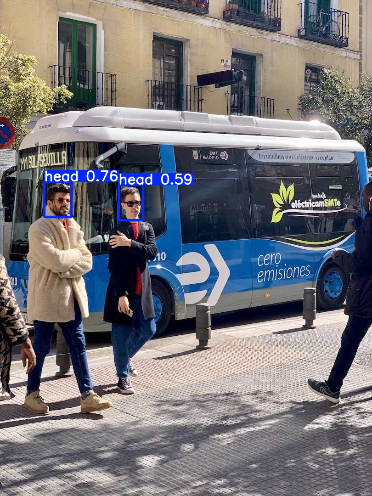

# Helmet Detection using YOLOv8

This project builds a computer vision model for helmet detection using YOLOv8 for workplace safety monitoring.

## Objective
- Detect helmets and related safety objects in images
- Explore end-to-end object detection workflow using YOLOv8
- Build a practical computer vision portfolio project

## Dataset
- Hard Hat Workers dataset
- Classes used:
  - head
  - helmet
  - person

## Methodology
1. Set up YOLOv8 environment and verify inference
2. Prepare dataset in YOLO format
3. Train a custom detection model
4. Evaluate model performance
5. Run prediction on sample images

## Results
The trained model produced the following validation performance:

- Precision: 0.893
- Recall: 0.456
- mAP50: 0.517
- mAP50-95: 0.301

### Class-wise Highlights
- **Helmet**
  - Precision: 0.897
  - Recall: 0.676
- **Head**
  - Precision: 0.783
  - Recall: 0.691
- **Person**
  - Performance was weak due to limited samples and lightweight training settings

## Key Insight
The model achieved strong precision, meaning its positive detections are generally reliable. Recall is lower, indicating that some objects are still missed. This is likely influenced by class imbalance and the lightweight training configuration used to fit local laptop constraints.

## Example Output

## Tech Stack
- Python
- Ultralytics YOLOv8
- OpenCV
- Matplotlib

## Future Improvements
- Train for more epochs on stronger hardware
- Improve class balance
- Expand from helmet detection to broader PPE detection
- Build a real-time webcam or CCTV demo

## Author
Vanessa Chriszella Rasubala